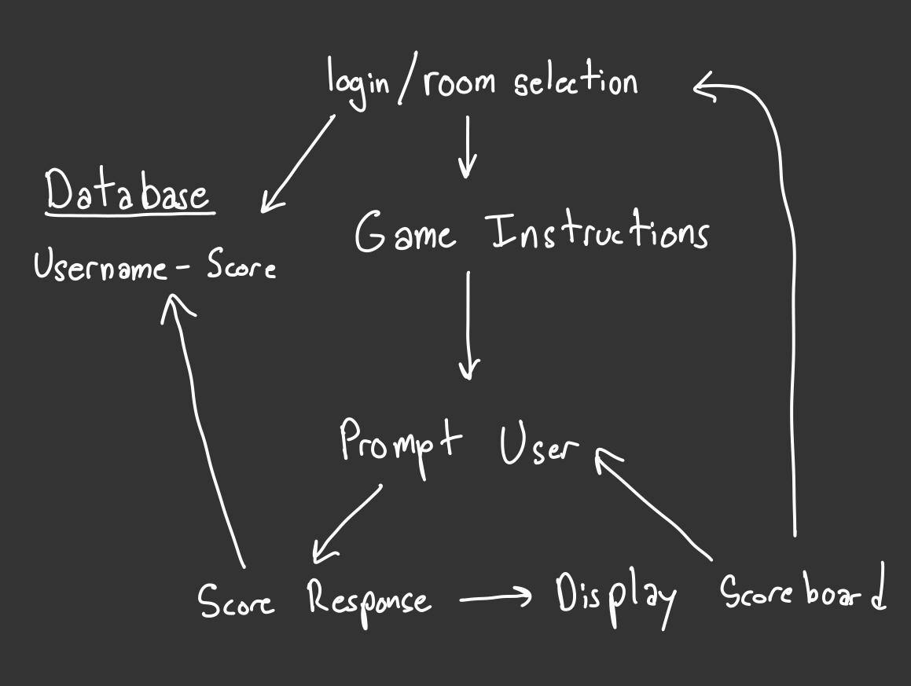
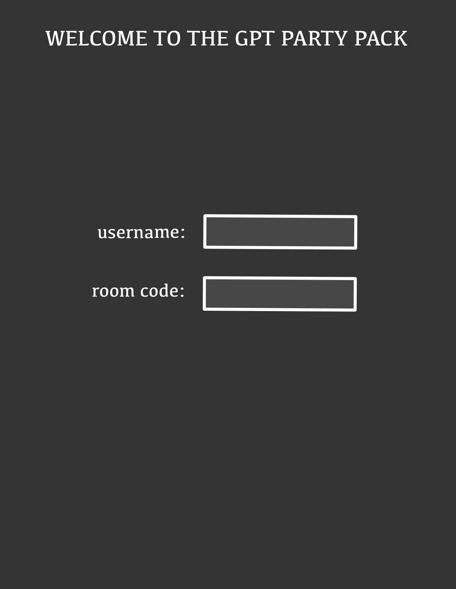

# THE ARTificial PARTY PACK

The ARTificial Party Pack is a collection of party games infused with the power of the world-renowned language model, GPT!

## Games

### Not Like The Others (I'll start with this one)

Step into a world of deception and deduction with 'Not Like The Others', the game that challenges you to spot an imposter among a sea of players through analysis and shrewd observation!

---
### Key features

- Secure login over HTTPS
- The user can join a multiplayer game with a room code
- Use GPT to generate questions
- Prompt the user for a response to a question
- Display responses from other users
- Users vote on other user's responses
- Results are persistently stored

---

### Technologies

I am going to use the required technologies in the following ways.

- **HTML** - Uses correct HTML structure for application. Two HTML pages. One for login and one for response/voting.
- **CSS** - Application styling that looks good on different screen sizes, uses good whitespace, color choice and contrast.
- **JavaScript** - Provides login, response display, applying votes, display score board, backend endpoint calls.
- **Service** - Backend service with endpoints for:
  - login
  - retrieving responses
  - submitting votes
  - retrieving vote status
- **DB** - Store users, responses, votes, and score in database.
- **Login** - Register and login users. Credentials securely stored in database. Cant join game without login
- **WebSocket** - As each user votes, their votes are broadcast to all other users.
- **React** - Application ported to use the React web framework.

---

## HTML deliverable

For this deliverable I added the application structure.

- **HTML pages** - 14 HTML pages that represent the ability to join a game, choose a game to host, respond to a prompt, vote, display the scoreboard,login, and create an account.
- **Links** - Game Selection -> Waiting Room -> Game Instruction -> Response -> Voting -> Display Score -> Response or index
- **Text** - All of the questions are represented as textual elements. The about section hosts a lot of text as well.
- **Images** - Logo in the top left of the page. For each of the games there is an associated crown icon.
- **Login** - Input box and submit button for login. Also option to create an account.
- **Database** - The voting choices represent data pulled from the database. Questions are pulled from a database.
- **WebSocket** - The count of voting results represent the tally of realtime votes.

## CSS deliverable

For this deliverable I properly styled the application into its final appearance.

- Header, footer, and main content body
- **Navigation elements** - I removed text decoration
- **Responsive to window resizing** - My app looks great on all window sizes and devices. 
- **Application elements** - Used good contrast and whitespace
- **Application text content** - Consistent font size and color
- **Application images** - I added two icons and a profile photo

## JavaScript deliverable

login - When you press enter or the login button it creates a User object that is ready to be sent to the server
database - not implemented yet
WebSocket - not implemented yet
Application logic (Host)- Once you start the game, it takes the host through three rounds. Each round consists of a user response period, a voting period, and then a display of the scoreboard. At the end of the game, it takes the host back to the game select menu.
application logic (User)- The player creates a Player object and joins a server. The player object is how responses and votes are sent to the server. As the game progresses the user provides a response and a vote for each round.

## Service deliverable 

For this deliverable, I created an HTTP service to host my frontend and provide backend endpoints.

Node.js/Express HTTP service - done!
Static middleware for the front end - done!
Calls to third-party endpoints - I don't need this for my website
Backend service endpoints - Placeholders for login that store the current user on the server. Endpoints for player and game state.
Frontend calls service endpoints - I did this using the fetch function.

## DB deliverable
For this deliverable, I stored and retrieved data from MongoDB.

MongoDB Atlas database created - done!
Populated database with game questions
Endpoints for data - My stubbed-out endpoints now process the data and send it to Mongo. 
Stores data in MongoDB - done!

## Login deliverable
For this deliverable, I added user registration and authentication.

User registration - Creates a new account in the database.
existing user - Verifies the user's name and password from data stored in the database
Use MongoDB to store credentials - done!
Restricts functionality - You cannot host a game until you have logged in.

---

## Design Images

### Workflow

### Game Screenshots

