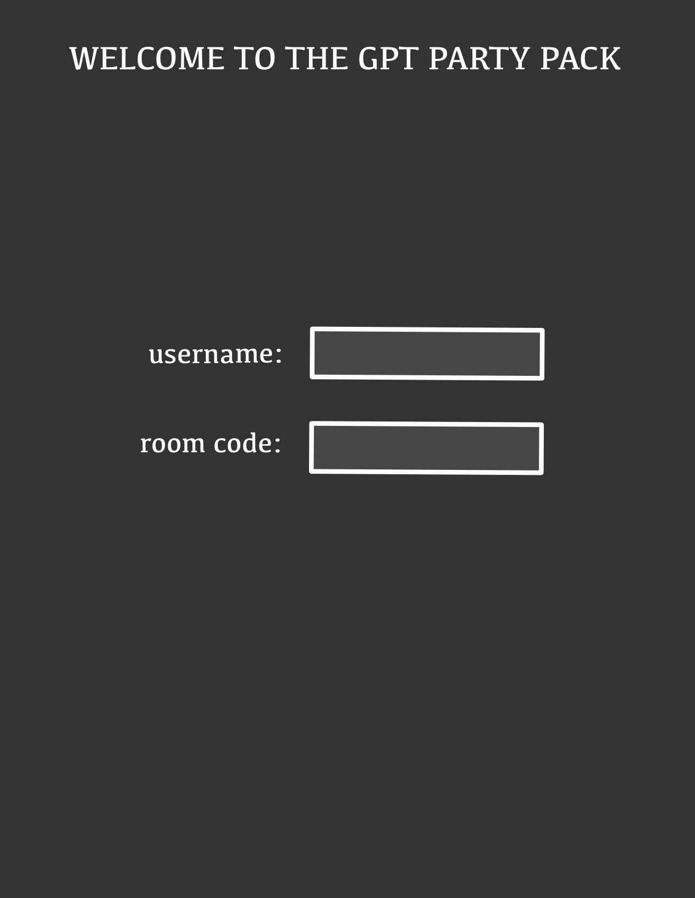
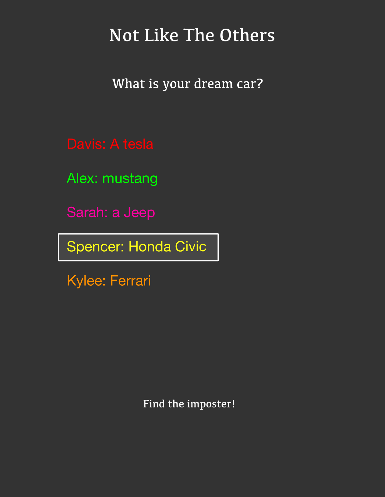
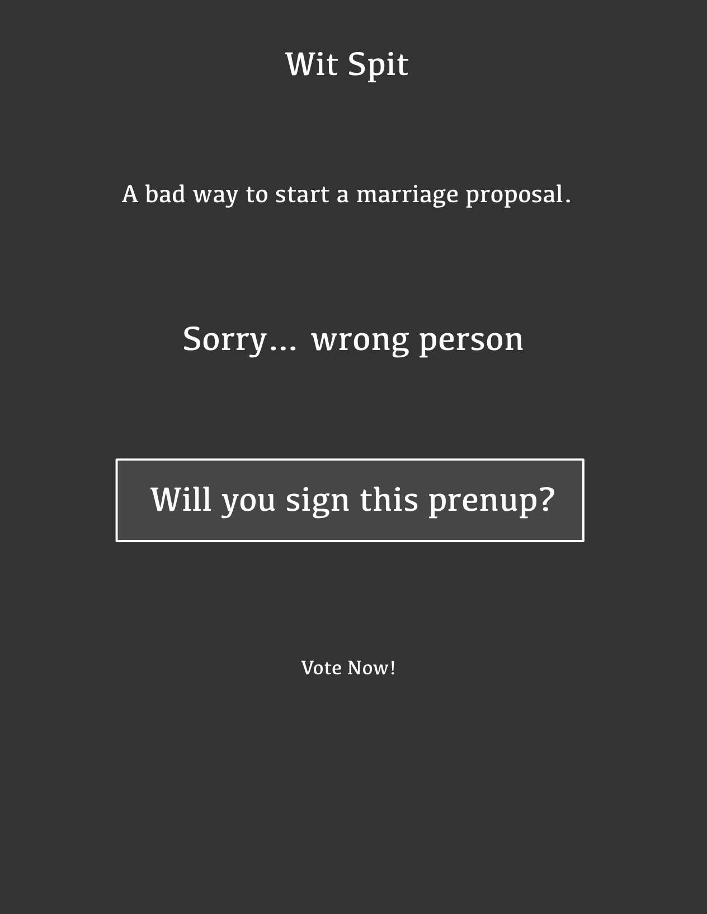

# THE GPT PARTY PACK

The GPT Party Pack is a collection of party games infused with the power of the world renound language model, GPT!

## Games

### Not Like The Others (I'll start with this one)

Step into a world of deception and deduction with 'Not Like The Others', the game that challenges you to spot an imposter among a sea of players through analysis and shrewd observation!

---

### GPT Trivia

Welcome to GPT Trivia! Our game uses GPT's state-of-the-art machine learning technology to constantly generate new and reliable questions, so you'll never run out of challenging and exciting trivia to test your knowledge. Compete against your friends and family to see who can get the highest score!

---

### Wit Spit

Wit Spit is a game of wit and speed where players must come up with the most creative and hilarious responses to a given prompt. The player with the most upvotes becomes the Wit Spit Champion!

---

### Definitionary

Definitionary is the ultimate word game where players are challenged to come up with the most convincing definition for a random word. Players then pick which definition they think is the most accurate and bonus points are awarded to those that pick the actual definition! The player with the most votes wins!

---
### Key features

- Secure login over HTTPS
- The user can join a multiplayer game with a room code
- Use GPT to generate questions
- Prompt the user for a response to a question
- Display responses from other users
- Users vote on other user's respsonses
- Results are persistently stored

---

### Technologies

I am going to use the required technologies in the following ways.

- **HTML** - Uses correct HTML structure for application. Two HTML pages. One for login and one for response/voting.
- **CSS** - Application styling that looks good on different screen sizes, uses good whitespace, color choice and contrast.
- **JavaScript** - Provides login, response display, applying votes, display score board, backend endpoint calls.
- **Service** - Backend service with endpoints for:
  - login
  - retrieving responses
  - submitting votes
  - retrieving vote status
- **DB** - Store users, responses, votes, and score in database.
- **Login** - Register and login users. Credentials securely stored in database. Cant join game without login
- **WebSocket** - As each user votes, their votes are broadcast to all other users.
- **React** - Application ported to use the React web framework.

---

## Design Images

### Workflow

### Game Screenshots

